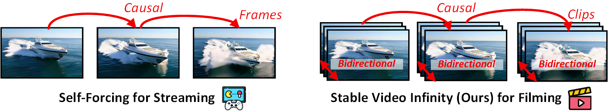
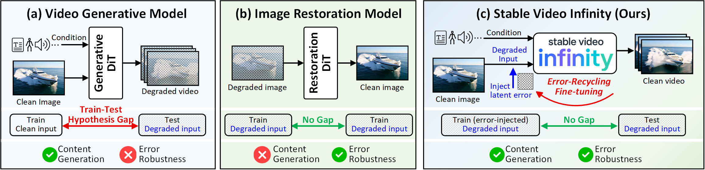

<div align="center">

<p align="center">
  
</p>

<h1>Stable Video Infinity: Infinite-Length Video Generation with Error Recycling</h1>

[Wuyang Li](https://wymancv.github.io/wuyang.github.io/) · [Wentao Pan](https://scholar.google.com/citations?user=sHKkAToAAAAJ&hl=zh-CN) · [Po-Chien Luan](https://scholar.google.com/citations?user=Y2Oth4MAAAAJ&hl=zh-TW) · [Yang Gao](https://scholar.google.com/citations?user=rpT0Q6AAAAAJ&hl=en) · [Alexandre Alahi](https://scholar.google.com/citations?user=UIhXQ64AAAAJ&hl=en)

[VITA@EPFL](https://www.epfl.ch/labs/vita/)

<a href='https://stable-video-infinity.github.io/homepage/'></a>
<a href='https://arxiv.org/abs/2510.09212'></a>
<a href='https://huggingface.co/vita-video-gen/svi-model/tree/main/version-1.0'></a>
<a href='https://huggingface.co/datasets/vita-video-gen/svi-benchmark'></a>

Technical introduction (unofficial): [AI Papers Slop (English)](https://www.youtube.com/watch?v=vKPCqPsCfZg); [WechatApp (Chinese)](https://mp.weixin.qq.com/s?__biz=MzIwMTE1NjQxMQ==&mid=2247641601&idx=1&sn=e86ae40b54fda22eda2ebd818b38de73&chksm=978a0c69a14a79192b1ca81f257f093362add316acdcdff69c67ab5d186f8af7f8e84931632a&mpshare=1&srcid=1016e1aTWfR71TRJJHDFgMHf&sharer_shareinfo=273ee623f20eba9542ff4b8c3a0c35d1&sharer_shareinfo_first=559e5442227d44f61573005b4e12d83c&from=timeline&scene=2&subscene=2&clicktime=1761249340&enterid=1761249340&sessionid=0&ascene=45&fasttmpl_type=0&fasttmpl_fullversion=7965100-zh_CN-zip&fasttmpl_flag=0&realreporttime=1761249340647#rd)
</div>


<div align="center">
  <a href="https://youtu.be/p71Wp1FuqTw">
    
  </a>
</div>

## ✨ Highlight

*Stable Video Infinity* (SVI) is able to generate ANY-length videos with high temporal consistency, plausible scene transitions, and controllable streaming storylines in ANY domains.

- **OpenSVI**: Everything is open-sourced: training & evaluation scripts, datasets, and more.
- **Infinite Length**: No inherent limit on video duration; generate arbitrarily long stories (see the 10‑minute “Tom and Jerry” demo).
- **Versatile**: Supports diverse in-the-wild generation tasks: multi-scene short films, single‑scene animations, skeleton-/audio-conditioned generation, cartoons, and more.
- **Efficient**: Only LoRA adapters are tuned, requiring very little training data: anyone can make their own SVI easily.

If you think this project is useful, we would really appreciate your star ⭐, which encourages us to better develop the open-source community! This repository will be continuously maintained. Thank you!

</div>

**📧 Contact**: [wuyang.li@epfl.ch](mailto:wuyang.li@epfl.ch)

### Important Note for ComfyUI Users

We just identified major issues in the third-party ComfyUI workflow implementation (the incompatibility between LoRA and quantized models, padding and motion frame), leading to the total failure of SVI ([Issue #7](https://github.com/vita-epfl/Stable-Video-Infinity/issues/7) and [Issue #10](https://github.com/vita-epfl/Stable-Video-Infinity/issues/10)). We've contacted the ComfyUI team. We are working on fixing them — please stay tuned. Thank you for your understanding! Moer details are [here](https://github.com/kijai/ComfyUI-WanVideoWrapper/issues/1519). 

**If possible, please use our inference script in this repo at first.** We will update the fixed ComfyUI as soon as possible. Thank you so much.


## 🔥 News

[10-23-2025] The preview of Wan 2.2-5B-SVI (small-gpu friendly) and some tips for custom SVI implementation: See [DevLog](docs/DevLog.md)!  
[10-21-2025] The error-banking strategy is optimized, further imporving the stability. See details in [DevLog](docs/DevLog.md)!  
[10-13-2025] SVI is now fully open-sourced and online!


PS: Wan 2.2-5B-SVI is coming.  

## ❓ Frequently Asked Questions

### Bidirectional or Causal (Self-Forcing)?


*Self-Forcing achieves **frame-by-frame causality**, whereas SVI, a hybrid version, operates with **clip-by-clip causality** and **bidirectional attention within each clip**.*

Targeting film and creative content production, our SVI design mirrors a director's workflow: (1) Directors repeatedly review clips in both forward and reverse directions to ensure quality, often calling "CUT" and "AGAIN" multiple times during the creative process. SVI maintains bidirectionality within each clip to emulate this process. (2) After that, directors seamlessly connect different clips along the temporal axis with causality (and some scene-transition animation), which aligns with SVI's clip-by-clip causality. The Self-Forcing series is better suited for scenarios prioritizing real-time interaction (e.g., gaming). In contrast, SVI focuses on story content creation, requiring higher standards for both content and visual quality. Intuitively, SVI's paradigm has unique advantages in end-to-end high-quality video content creation.

<div align="center">
    
</div>


### Please Refer to [FAQ](docs/FAQ.md) for More Questions.

## 🔧 Environment Setup

We have tested the environment with A100 80G, cuda 12.0, and torch 2.8.0. This is our reproduced [environment](https://github.com/user-attachments/files/22899587/env.txt). The following script will automatically install the older version torch==2.5.0. We have also tested with the lower version: torch==2.4.1 and torch==2.5.0. Feel free to let me know if you meet issues.

```bash
conda create -n svi python=3.10 
conda activate svi

# For svi family
pip install -e .
pip install flash_attn==2.8.0.post2
# If you encounter issues with flash-attn installation, please refer to the details at https://github.com/vita-epfl/Stable-Video-Infinity/issues/3.

conda install -c conda-forge ffmpeg
conda install -c conda-forge librosa
conda install -c conda-forge libiconv
```

## 📦 Model Preparation

### Download Wan 2.1 I2V 14B

```bash
huggingface-cli download Wan-AI/Wan2.1-I2V-14B-480P --local-dir ./weights/Wan2.1-I2V-14B-480P
```

### Download SVI Family

| Model                           | Task                    | Input                      | Output           | Hugging Face Link                                                                                                                | Comments                                                                                                   |
| ------------------------------- | ----------------------- | -------------------------- | ---------------- | -------------------------------------------------------------------------------------------------------------------------------- | ---------------------------------------------------------------------------------------------------------- |
| **ALL**                   | Infinite possibility    | Image + X                  | X video          | [🤗 Folder](https://huggingface.co/vita-video-gen/svi-model/tree/main/version-1.0)                                                  | Family bucket! I want to play with all!                                                                    |
| **SVI-Shot**              | Single-scene generation | Image + Text prompt        | Long video       | [🤗 Model](https://huggingface.co/vita-video-gen/svi-model/resolve/main/version-1.0/svi-shot.safetensors?download=true)             | Generate consistent long video with 1 text prompt. (This will never drift or forget in our 20 min test)                                 |
| **SVI-Film-Opt-10212025**  (Latest)            | Multi-scene generation  | Image + Text prompt stream | Film-style video | [🤗 Model](https://huggingface.co/vita-video-gen/svi-model/resolve/main/version-1.0/svi-film-opt-10212025.safetensors)             | Generate creative long video with 1 text prompt stream (5 second per text).                                |
| **SVI-Film**              | Multi-scene generation  | Image + Text prompt stream | Film-style video | [🤗 Model](https://huggingface.co/vita-video-gen/svi-model/resolve/main/version-1.0/svi-film.safetensors?download=true)             | Generate creative long video with 1 text prompt stream (5 second per text).                                |
| **SVI-Film (Transition)** | Multi-scene generation  | Image + Text prompt stream | Film-style video | [🤗 Model](https://huggingface.co/vita-video-gen/svi-model/resolve/main/version-1.0/svi-film-transitions.safetensors?download=true) | Generate creative long video with 1 text prompt stream. (More scene transitions due to the training data)  |
| **SVI-Tom&Jerry**         | Cartoon animation       | Image                      | Cartoon video    | [🤗 Model](https://huggingface.co/vita-video-gen/svi-model/resolve/main/version-1.0/svi-tom.safetensors?download=true)              | Generate creative long cartoon videos with 1 text prompt stream (This will never drift or forget in our 20 min test) |
| **SVI-Talk**              | Talking head            | Image + Audio              | Talking video    | [🤗 Model](https://huggingface.co/vita-video-gen/svi-model/resolve/main/version-1.0/svi-talk.safetensors?download=true)             | Generate long videos with audio-conditioned human speaking   (This will never drift or forget in our 10 min test)                                              |
| **SVI-Dance**             | Dancing animation       | Image + Skeleton           | Dance video      | [🤗 Model](https://huggingface.co/vita-video-gen/svi-model/resolve/main/version-1.0/svi-dance.safetensors?download=true)            | Generate long videos with skeleton-conditioned human dancing                                               |

Note: If you want to play with T2V, you can directly use SVI with an image generated by any T2I model!

```bash
# login with your fine-grained token
huggingface-cli login

# Option 1: Download SVI Family bucket!
huggingface-cli download vita-video-gen/svi-model --local-dir ./weights/Stable-Video-Infinity --include "version-1.0/*"

# Option 2: Download individual models
# huggingface-cli download vita-video-gen/svi-model version-1.0/svi-shot.safetensors --local-dir ./weights/Stable-Video-Infinity
# huggingface-cli download vita-video-gen/svi-model version-1.0/svi-film-opt-10212025.safetensors  --local-dir ./weights/Stable-Video-Infinity
# huggingface-cli download vita-video-gen/svi-model version-1.0/svi-film.safetensors --local-dir ./weights/Stable-Video-Infinity
# huggingface-cli download vita-video-gen/svi-model version-1.0/svi-film-transitions.safetensors --local-dir ./weights/Stable-Video-Infinity
# huggingface-cli download vita-video-gen/svi-model version-1.0/svi-tom.safetensors --local-dir ./weights/Stable-Video-Infinity
# huggingface-cli download vita-video-gen/svi-model version-1.0/svi-talk.safetensors --local-dir ./weights/Stable-Video-Infinity
# huggingface-cli download vita-video-gen/svi-model version-1.0/svi-dance.safetensors --local-dir ./weights/Stable-Video-Infinity
```

### Download Multitalk Cross-Attention for SVI-Talk Training/Test

```bash
# Download audio encoder
huggingface-cli download TencentGameMate/chinese-wav2vec2-base --local-dir ./weights/chinese-wav2vec2-base 
huggingface-cli download TencentGameMate/chinese-wav2vec2-base model.safetensors --revision refs/pr/1 --local-dir ./weights/chinese-wav2vec2-base

# Download multitalk weight
huggingface-cli download MeiGen-AI/MeiGen-MultiTalk --local-dir ./weights/MeiGen-MultiTalk

# Link Multitalk
ln -s $PWD/weights/MeiGen-MultiTalk/multitalk.safetensors weights/Wan2.1-I2V-14B-480P/
```

### Download UniAnimate-DiT LoRA for SVI-Dance Training

```bash
huggingface-cli download ZheWang123/UniAnimate-DiT --local-dir ./weights/UniAnimate-DiT
```

### Check Model

After downloading all the models, your `weights/` directory structure should look like this:

```
weights/
├── Wan2.1-I2V-14B-480P/
│   ├── diffusion_pytorch_model-00001-of-00007.safetensors
│   ├── diffusion_pytorch_model-00002-of-00007.safetensors
│   ├── diffusion_pytorch_model-00003-of-00007.safetensors
│   ├── diffusion_pytorch_model-00004-of-00007.safetensors
│   ├── diffusion_pytorch_model-00005-of-00007.safetensors
│   ├── diffusion_pytorch_model-00006-of-00007.safetensors
│   ├── diffusion_pytorch_model-00007-of-00007.safetensors
│   ├── diffusion_pytorch_model.safetensors.index.json
│   ├── models_clip_open-clip-xlm-roberta-large-vit-huge-14.pth
│   ├── models_t5_umt5-xxl-enc-bf16.pth
│   ├── Wan2.1_VAE.pth
│   ├── multitalk.safetensors (symlink)
│   └── README.md
├── Stable-Video-Infinity/
│   └── version-1.0/
│       ├── svi-shot.safetensors
│       ├── svi-film.safetensors
│       ├── svi-film-transitions.safetensors
│       ├── svi-tom.safetensors
│       ├── svi-talk.safetensors
│       └── svi-dance.safetensors
├── chinese-wav2vec2-base/ (for SVI-Talk)
│   ├── config.json
│   ├── model.safetensors
│   ├── preprocessor_config.json
│   └── README.md
├── MeiGen-MultiTalk/ (for SVI-Talk)
│   ├── diffusion_pytorch_model.safetensors.index.json
│   ├── multitalk.safetensors
│   └── README.md
└── UniAnimate-DiT/ (for SVI-Dance)
    ├── dw-ll_ucoco_384.onnx
    ├── UniAnimate-Wan2.1-14B-Lora-12000.ckpt
    ├── yolox_l.onnx
    └── README.md
```

## 🎮 Play with Official SVI

### Inference Scripts

The following scripts will use data in `data/demo` for inference. You can also use custom data to inference by simply changing the data path.

```bash
# SVI-Shot
bash scripts/test/svi_shot.sh 

# SVI-Film
bash scripts/test/svi_film.sh 

# SVI-Talk
bash scripts/test/svi_talk.sh 

# SVI-Dance
bash scripts/test/svi_dance.sh 

# SVI-Tom&Jerry
bash scripts/test/svi_tom.sh 
```

### Gradio Demo

Currently, gradio demo only supports SVI-Shot and SVI-Film.

```bash
bash gradio_demo.sh
```

## 🔥 Train Your Own SVI

We have prepared the toy training data `data/toy_train/`. You can simply follow the data format to train SVI with your custom data.
Please modify `--num_nodes` if you use more nodes for training. We have tested both 8 and 64 GPUs for training, where larger batch-size gave a better performance.

### SVI-Shot

```bash
# (Optionally) Use scripts/data_preprocess/process_mixkit.py from CausVid to pre-process data
# start training
bash scripts/train/svi_shot.sh 
```

### SVI-Film

```bash
# (Optionally) Use scripts/data_preprocess/process_mixkit.py from CausVid to pre-process data
# start training
bash scripts/train/svi_film.sh 
```

### SVI-Talk

```bash
# Preprocess the toy training data
python scripts/data_preprocess/prepare_video_audio.py 

# Start training
bash scripts/train/svi_talk.sh 
```

### SVI-Dance

```bash
# Preprocess the toy training data
python scripts/data_preprocess/prepare_video_audio.py 

# Start training
bash scripts/train/svi_dance.sh 
```

## 📝 Test Your Trained SVI

### Model Post-processing

```bash
# Change .pt files to .safetensors files
# zero_to_fp32.py will be automatically generated in your model dir, change $DIR_WITH_SAFETENSORS into your desired DIR
python zero_to_fp32.py . $DIR_WITH_SAFETENSORS --safe_serialization

# (Optionally) Extract and only save LoRA parameters to reduce disk space
python utils/extract_lora.py --checkpoint_dir $DIR_WITH_SAFETENSORS --output_dir $XXX
```

### Inference

Please modify the inference scripts in `./scripts/test/` accordingly by changing the inference samples and your new weight

## 🗃️ Datasets

You can also use our benchmark datasets made by our Automatic Prompt Stream Engine (see Appendix. A for more details), where you can find images and associated prompt streams according to specific storylines.

| Data                                               | Use  | HuggingFace Link                                                                                            | Comment                                                                                           |
| -------------------------------------------------- | ---- | ----------------------------------------------------------------------------------------------------------- | ------------------------------------------------------------------------------------------------- |
| **Consistent Video Generation**              | Test | [🤗 Dataset](https://huggingface.co/datasets/vita-video-gen/svi-benchmark/tree/main/consisent_video_gen)       | Generate 1 long video using 1 text prompt                                                         |
| **Creative Video Generation**                | Test | [🤗 Dataset](https://huggingface.co/datasets/vita-video-gen/svi-benchmark/tree/main/creative_video_gen)        | Generate 1 long video using 1 text prompt stream according to storyline (1 prompt for 5 sec clip) |
| **Creative Video Generation (More prompts)** | Test | [🤗 Dataset](https://huggingface.co/datasets/vita-video-gen/svi-benchmark/tree/main/creative_video_gen_longer) | Generate 1 long video using 1 text prompt stream according to storyline (1 prompt for 5 sec clip) |

The following is the training data we used for SVI family.

| Data                                           | Use   | HuggingFace Link                                                                                     | Comment                                                 |
| ---------------------------------------------- | ----- | ---------------------------------------------------------------------------------------------------- | ------------------------------------------------------- |
| **Customized Datasets**                  | Train | [🤗 Dataset](https://huggingface.co/datasets/vita-video-gen/svi-benchmark/tree/main/customized_dataset) | You can make your customized datasets using this format |
| **Consistent/Creative Video Generation** | Train | [🤗 Dataset](https://huggingface.co/datasets/LanguageBind/Open-Sora-Plan-v1.1.0/tree/main/all_mixkit)   | MixKit Dataset                                           |
| **Consistent/Creative Video Generation** | Train | [🤗 Dataset](https://huggingface.co/datasets/APRIL-AIGC/UltraVideo-Long)                                | UltraVideo Dataset                                      |
| **Human Talking**                        | Train | [🤗 Dataset](https://huggingface.co/fudan-generative-ai/hallo3)                                         | 5k subset from Hallo 3                                  |
| **Human Dancing**                        | Train | [🤗 Dataset](https://www.kaggle.com/datasets/yasaminjafarian/tiktokdataset)                             | TikTok                                                  |

```bash
huggingface-cli download --repo-type dataset vita-video-gen/svi-benchmark --local-dir ./data/svi-benchmark
```

## 📋 TODO List

- [X] Release everything about SVI
- [ ] SVI quantization for commercial GPUs [Issue #7]
- [ ] Wan 2.2 5B based SVI [Issue #1 #7]
- [ ] Wan 2.2 14B based SVI [Issue #1]
- [ ] Streaming generation model 

- [Call for TODO]  Write down your idea in the Issue

## 🙏 Acknowledgement

We greatly appreciate the tremendous effort for the following fantastic projects!

[1] [Wan: Open and Advanced Large-Scale Video Generative Models](https://arxiv.org/abs/2503.20314)  
[2] [UniAnimate-DiT: Human Image Animation with Large-Scale Video Diffusion Transformer](https://arxiv.org/abs/2504.11289)  
[3] [Let Them Talk: Audio-Driven Multi-Person Conversational Video Generation](https://arxiv.org/abs/2505.22647)

## ❤️ Citation

If you find our work helpful for your research, please consider citing our paper. Thank you so much!

```bibtex
@article{li2025stable,
  title={Stable Video Infinity: Infinite-Length Video Generation with Error Recycling},
  author={Li, Wuyang and Pan, Wentao and Luan, Po-Chien and Gao, Yang and Alahi, Alexandre},
  journal={arXiv preprint arXiv:2510.09212},
  year={2025}
}
```

## 📌 Abstract

We propose **Stable Video Infinity (SVI)** that is able to generate infinite-length videos with high temporal consistency, plausible scene transitions, and controllable streaming storylines. While existing long-video methods attempt to *mitigate accumulated errors* via handcrafted anti-drifting (e.g., modified noise scheduler, frame anchoring), they remain limited to single-prompt extrapolation, producing homogeneous scenes with repetitive motions. We identify that the fundamental challenge extends beyond error accumulation to a critical discrepancy between the training assumption (seeing clean data) and the test-time autoregressive reality (conditioning on self-generated, error-prone outputs). To bridge this hypothesis gap, SVI incorporates **Error-Recycling Fine-Tuning**, a new type of efficient training that recycles the Diffusion Transformer (DiT)'s self-generated errors into supervisory prompts, thereby encouraging DiT to *actively identify and correct its own errors*. This is achieved by injecting, collecting, and banking errors through closed-loop recycling, autoregressively learning from error-injected feedback. Specifically, we (i) inject historical errors made by DiT to intervene on clean inputs, simulating error-accumulated trajectories in flow matching; (ii) efficiently approximate predictions with one-step bidirectional integration and calculate errors with residuals; (iii) dynamically bank errors into replay memory across discretized timesteps, which are resampled for new input. SVI is able to scale videos from seconds to infinite durations with no additional inference cost, while remaining compatible with diverse conditions (e.g., audio, skeleton, and text streams). We evaluate SVI on three benchmarks, including consistent, creative, and conditional settings, thoroughly verifying its versatility and state-of-the-art role.

<div align="center">
    
</div>
