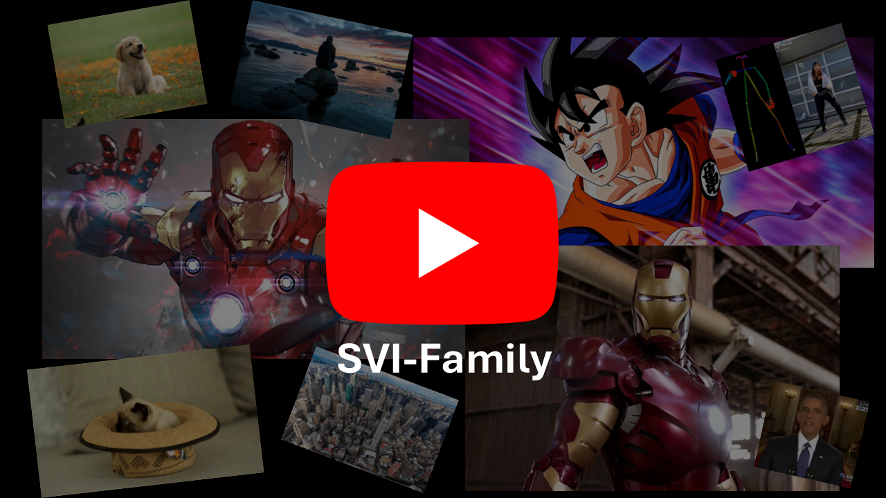
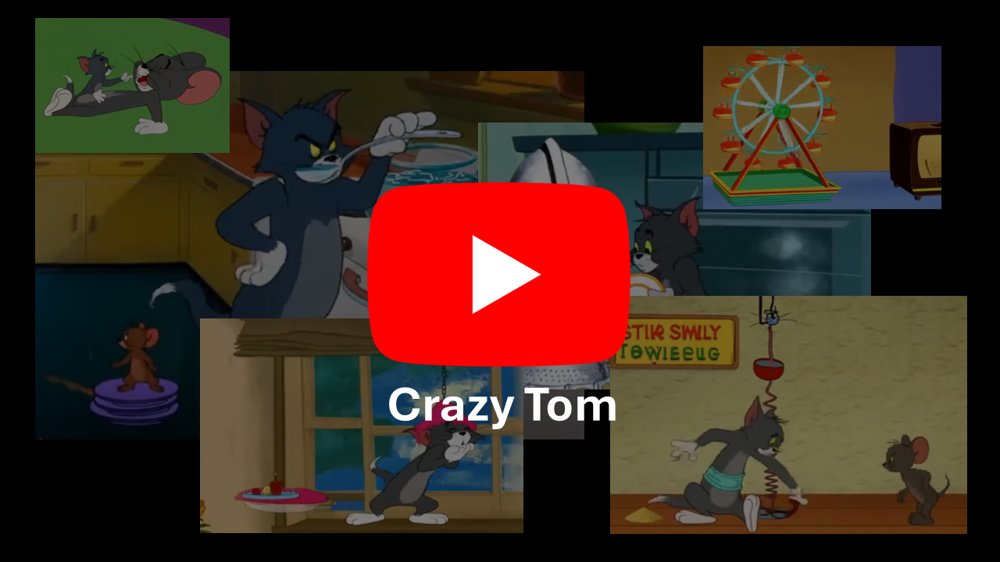
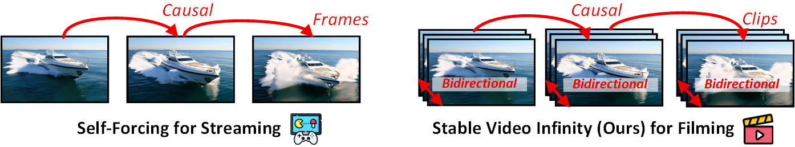

<div align="center">

<p align="center">
  
</p>

<h1>Stable Video Infinity: Infinite-Length Video Generation with Error Recycling (Wan 2.2 14B)</h1>

[Wuyang Li](https://wymancv.github.io/wuyang.github.io/) · [Wentao Pan](https://scholar.google.com/citations?user=sHKkAToAAAAJ&hl=zh-CN) · [Po-Chien Luan](https://scholar.google.com/citations?user=Y2Oth4MAAAAJ&hl=zh-TW) · [Yang Gao](https://scholar.google.com/citations?user=rpT0Q6AAAAAJ&hl=en) · [Alexandre Alahi](https://scholar.google.com/citations?user=UIhXQ64AAAAJ&hl=en)

[VITA@EPFL](https://www.epfl.ch/labs/vita/)

<a href='https://stable-video-infinity.github.io/homepage/'></a>
<a href='https://arxiv.org/abs/2510.09212'></a>
<a href='https://huggingface.co/vita-video-gen/svi-model/tree/main/version-1.0'></a>
<a href='https://huggingface.co/datasets/vita-video-gen/svi-benchmark'></a>

Technical introduction (unofficial): [AI Papers Slop (English)](https://www.youtube.com/watch?v=vKPCqPsCfZg); [WechatApp (Chinese)](https://mp.weixin.qq.com/s?__biz=MzIwMTE1NjQxMQ==&mid=2247641601&idx=1&sn=e86ae40b54fda22eda2ebd818b38de73&chksm=978a0c69a14a79192b1ca81f257f093362add316acdcdff69c67ab5d186f8af7f8e84931632a&mpshare=1&srcid=1016e1aTWfR71TRJJHDFgMHf&sharer_shareinfo=273ee623f20eba9542ff4b8c3a0c35d1&sharer_shareinfo_first=559e5442227d44f61573005b4e12d83c&from=timeline&scene=2&subscene=2&clicktime=1761249340&enterid=1761249340&sessionid=0&ascene=45&fasttmpl_type=0&fasttmpl_fullversion=7965100-zh_CN-zip&fasttmpl_flag=0&realreporttime=1761249340647#rd)
</div>


<<<<<<< HEAD
We really appreciate the beautiful videos created by [@RuneGjerde](https://github.com/RuneGjerde) using SVI!

<table>
  <tr>
    <td width="50%">
      <video src="https://github.com/user-attachments/assets/568edfc7-5aaf-4f9a-ba21-9226e161a227"
=======
<div align="center">
<table width="100%">
  <tr>
    <td align="center" width="33%">
      <a href="https://youtu.be/p71Wp1FuqTw">
        
      </a>
      <br>
      Quick Glance at the SVI Family
    </td>
    <td align="center" width="33%">
      <a href="https://www.youtube.com/watch?v=xEgVF3fAZ5o">
        
      </a>
      <br>
      8‑minute crazy Tom & Jerry video made with SVI‑Tom
    </td>
    <td align="center" width="33%">
      <a href="https://www.youtube.com/watch?v=a7Zx5e9ZjK4">
        
      </a>
      <br>
      14‑minute videos made with SVI‑2.0 (based on Wan 2.1) and SVI‑Talk.
    </td>
  </tr>
</table>
</div>

## 🚀 [26 Dec 2025 News] Update SVI 2.0 Pro for Wan 2.2

- [main (this branch)](https://github.com/vita-epfl/Stable-Video-Infinity#): SVI using Wan 2.1 base model (both SVI 1.0/2.0)

- [svi_wan22 branch](https://github.com/vita-epfl/Stable-Video-Infinity/tree/svi_wan22): SVI using Wan 2.2 base model (both SVI 2.0/2.0 Pro)


## ✨ SVI 2.0 Pro ComfyUI Workflows and Videos from the Community (Not us!)

Thanks to many enthusiastic community users who keep creating and updating various SVI workflows, we now have a growing collection of different features and use cases. Please refer to the [pinned issue](https://github.com/vita-epfl/Stable-Video-Infinity/issues/51) for a summarized overview of these workflows. We will continuously update that issue to showcase more interesting and useful SVI workflows. When using them, please check out the pinned issue for updated important tips, e.g.,

- **Use different seeds for different clips, which is very important!**
- **Enhance prompts & reduce LightX2V usgae & use more optimal resolution (480p) to relieve slow motion.**
- **Avoid using the wrong SVI 1.0 workflow in this repo.**

###  Community Deployment

SVI-2.0 Pro is now available on the Poe platform! You can access it through the Poe chat interface or integrate it via their API. Check it out here [link](https://poe.com/SVI-2.0-Pro). ❤️ Big thanks to [@empiriolabsai](https://empiriolabs.ai/) for their support!

### Some Community Workflow Tutorials

Really appreciate the attention from community Youtubers and Bilibili creators.

- ❤️ Big thanks to the amazing Youtuber [@AI Search](https://www.youtube.com/@theAIsearch) for his fantastic SVI tutoral [[Link]](https://www.youtube.com/watch?v=-3DVJu72VhE)!

- ❤️ Big thanks to the amazing Youtuber @[ComfyUI Workflow Blog](https://www.youtube.com/@ComfyUIworkflows) making tutoral about generating **40-second highly dynamic videos witout any color degragation** [[Link]](https://www.youtube.com/watch?v=PJnTcVOqJCM&t=209s).
  
- ❤️ Big thanks to the amazing Bilibili creator [@AI Aiwood](https://space.bilibili.com/503934057?spm_id_from=333.788.upinfo.detail.click) for his three amazing SVI tutorals about long-shot videos ([[Link]](https://www.bilibili.com/video/BV1oevyB6Eyh/?spm_id_from=333.1387.homepage.video_card.click)), multi-shot videos ([[Link]](https://www.bilibili.com/video/BV1LjvpBCE1t/?spm_id_from=333.1387.homepage.video_card.click)), and video extension ([[Link]](https://www.bilibili.com/video/BV1DdvxBCExf/?spm_id_from=333.1387.homepage.video_card.click))!

- ❤️ Big thanks to the amazing Bilibili creators [@AI 与AI同行1996](https://www.bilibili.com/video/BV11yigBfE4H/?spm_id_from=333.337.search-card.all.click) for his 1-min stress test of SVI without color drift! [@AI绘视玩家](https://www.bilibili.com/video/BV1ggvWBqEb6/?spm_id_from=333.337.search-card.all.click&vd_source=04231a7d0b782d8fd0204e75f4f7dd34) for his stress test of storytelling long videos. [@三当家AI](https://www.bilibili.com/video/BV1BQveBEExr/?spm_id_from=333.1387.favlist.content.click) for the test of different Wan base model varients, and the videos from amazing Youtuber [@Jaevlon](https://www.youtube.com/@AIArtistryAtelier).

### Use Cases from the Community

Here are some beautiful videos generated by creative **community users (not us)** using SVI 2.0 Pro workflows! Please don’t hesitate to share your SVI creations with us!  

**If your video quality differs significantly from the community example below (e.g., flickering or noticeable degradation), please double-check that you are using the workflow correctly. Besides, please turn on the sound of the following video for the best experience.**


<video src="https://github.com/user-attachments/assets/76444344-f033-4ecb-a987-2dd1973a84b6"
       controls
       muted
       width="100%">
</video>
<p align="center">Caption: Please turn on the sound at first! Video credit to community creator @PT. This is an unsolicited, non-paid promotional video with sound for SVI Pro 2.0 created independently by a community user (not affiliated with us). The video is first generated with SVI, then lip alignment is refined using InfiniteTalk@Meituan (PS: Big thanks to Longcat team!). The English voiceover says: “Many people ask what SVI Pro can do, it's about generating long videos without quality degradation. I love continuous camera moves and narration. Combined with amazing Wan 2.2, it’s simply an epic ride westward.”</p>


<div align="center">
  <video src="https://github.com/user-attachments/assets/85be88f3-f029-46ea-b600-9f9dc7c2a7a3"
         controls
         muted
         width="600">
  </video>

  <p>Caption: Please turn on the sound at first! Big thanks to @ ̮  (̲͡-̲̅ .̲̅ ̲̅͡- ̲). Happy New Year!</p>
</div>


<table>
  <tr>
    <td>
      <video src="https://github.com/user-attachments/assets/8ece79f2-cd40-45ad-9f9d-3c835195137d"
>>>>>>> main
             controls
             muted
             width="100%">
      </video>
<<<<<<< HEAD
    </td>
    <td width="50%">
      <video src="https://github.com/user-attachments/assets/a5a23659-90fb-475f-bfff-6b08ea67d294"
=======
      <p align="center">Big thanks to @PT.</p>
    </td>
    <td>
      <video src="https://github.com/user-attachments/assets/4f8b828a-cb6d-4287-bd55-c1585f8cfc19"
>>>>>>> main
             controls
             muted
             width="100%">
      </video>
<<<<<<< HEAD
    </td>
  </tr>
</table


## ✨ New Features

1. **Better dynamics:** Compared with the Wan 2.1 version, SVI 2.0 Pro produces more dynamic and natural motion, thanks to the inherent capabilities of Wan 2.2.

2. **Cross-clip consistency:** This version provides a certain level of cross-clip consistency. As shown in the demo, your cat is still your cat: Even when a character completely leaves the frame in one clip and reappears several clips later, the model maintains a reasonable degree of visual consistency.

SVI 2.0 Gallery
<table>
  <tr>
    <td>
      <video src="https://github.com/user-attachments/assets/7bdb3120-ec18-4def-9356-49ebf95293f3"
             controls
             muted
             width="100%">
      </video>
      <p align="center">Your cat is still your cat</p>
    </td>
    <td>
      <video src="https://github.com/user-attachments/assets/fd88fc44-38e9-4972-ad41-5f384eec8191"
             controls
             muted
             width="100%">
      </video>
      <p align="center">Your dog can run anywhere</p>
    </td>
    <td>
      <video src="https://github.com/user-attachments/assets/6172b2a0-7f77-490e-9fd2-2f372aba936a"
             controls
             muted
             width="100%">
      </video>
      <p align="center">Your baby is still your baby</p>
    </td>
  </tr>
</table>

SVI 2.0 Pro Gallery
- More dynamic and expressive motions  
- Support for a wider range of scene transitions
- More interesting

<table>
  <tr>
    <td>
      <video src="https://github.com/user-attachments/assets/e6d270ab-6992-4b60-a12a-6512b2e5dd33"
             controls
             muted
             width="100%">
      </video>
    </td>
    <td>
      <video src="https://github.com/user-attachments/assets/6070774e-f4fd-4194-ad7c-731859239395"
             controls
             muted
             width="100%">
      </video>
    </td>
    <td>
      <video src="https://github.com/user-attachments/assets/4709eb7c-ac4c-4c12-a4f0-20a91d2a64ad"
             controls
             muted
             width="100%">
      </video>
    </td>
  </tr>
</table>


<table>
  <tr>
    <td>
      <video src="https://github.com/user-attachments/assets/cfc630aa-ee03-4909-ad81-1dac85b63c99"
             controls
             muted
             width="100%">
      </video>
    </td>
    <td>
      <video src="https://github.com/user-attachments/assets/231cff4e-fd22-415e-ab50-fc996e3160e7"
             controls
             muted
             width="100%">
      </video>
    </td>
    <td>
      <video src="https://github.com/user-attachments/assets/1c829fe1-550c-4075-8a6c-419b232c1c85"
             controls
             muted
             width="100%">
      </video>
    </td>
  </tr>
</table>


## 🚀 News about Wan 2.2-based SVI

- **[26 Dec 2025] SVI 2.0 Pro Released:** More details can be found [svi_2.0_pro.md](docs/svi/svi_2.0_pro.md).

- **[4 Dec 2025] SVI 2.0 Released**  
 

<table>
  <tr>
    <td width="50%">
      <video src="https://github.com/user-attachments/assets/7bdb3120-ec18-4def-9356-49ebf95293f3"
             controls
             muted
             width="100%">
      </video>
      <p align="center">SVI 2.0</p>
    </td>
    <td width="50%">
      <video src="https://github.com/user-attachments/assets/231cff4e-fd22-415e-ab50-fc996e3160e7"
             controls
             muted
             width="100%">
      </video>
      <p align="center">SVI 2.0 Pro</p>
    </td>
  </tr>
</table>

## 😀 ComfyUI Users

- **[26 Dec 2025] SVI 2.0 Pro**: We have redesigned some core components of SVI 2.0 Pro, so this version is no longer compatible with the original workflow. More details can be found [svi_2.0_pro.md](docs/svi/svi_2.0_pro.md).

- **[10 Dec 2025] SVI 2.0**: check out our preview workflow: `Stable-Video-Infinity/comfyui_workflow`! Unfortunately, we noticed a conflict between the LightX2V LoRA and the SVI LoRA: more details can be found [here](./docs/svi/comfyui.md).


## ❓More Information

1. **Platform:** This branch is built on the updated Diffsynth 2.0, so the environment needs to be reconfigured accordingly. P.S. Great thanks to the Diffsynth team for their outstanding codebase maintenance.

2. **Re-implementation Tips:** To enhance dynamics, particularly exit–reenter consistency, we introduce a simple yet effective modification: following the SVI-Shot training setup, we ensure that the randomly sampled padding frame never appears in the currently generated video clips. For example, we may use frames 1–81 for generation and reserve frame 100 exclusively for padding. In addition, we also apply strong image augmentation to the first frame to encourage the model to perform restoration guided by the padding (i.e., the anchor).

3. **Tips for Generating Better Long Videos:** Please refer to [tips.md](./docs/svi/tips.md).


=======
      <p align="center">Big thanks to @邂逅2004.</p>
    </td>
    <td>
      <video src="https://github.com/user-attachments/assets/46684a37-6f5f-4c84-b69a-a8e5e358dda1"
             controls
             muted
             width="100%">
      </video>
      <p align="center">Big thanks to <a href="https://github.com/RuneGjerde">@RuneGjerde</a>.</p>
    </td>
  </tr>
</table>


<table>
  <tr>
    <td>
      <video src="https://github.com/user-attachments/assets/c02d680e-d64e-42fd-905c-2031588a67b4"
             controls
             muted
             width="100%">
      </video>
      <p align="center">Big thanks to @XXX.</p>
    </td>
    <td>
      <video src="https://github.com/user-attachments/assets/ac31b884-b1b5-438e-a38a-b189b97ee606"
             controls
             muted
             width="100%">
      </video>
      <p align="center">Big thanks to <a href="https://github.com/Jaevlon">@Jaevlon</a>.</p>
    </td>
    <td>
      <video src="https://github.com/user-attachments/assets/e499966a-89b2-4f16-9ac7-d30da0d435a3"
             controls
             muted
             width="100%">
      </video>
      <p align="center">Big thanks to @高姿态的浅唱.</p>
    </td>
  </tr>
</table>


<table>
  <tr>
    <td>
      <video src="https://github.com/user-attachments/assets/e068db3e-a25f-4557-8462-2ca82c2881c0"
             controls
             muted
             width="100%">
      </video>
      <p align="center">Big thanks to @Aiwood.</p>
    </td>
    <td>
      <video src="https://github.com/user-attachments/assets/f522b325-2088-473e-b6e1-183ec0f2acfb"
             controls
             muted
             width="100%">
      </video>
       <p align="center">Big thanks to @Aiwood.</p>
    </td>
    <td>
      <video src="https://github.com/user-attachments/assets/f837b116-6d1c-473d-ae57-c13dfce70ba7"
             controls
             muted
             width="100%">
      </video>
      <p align="center">Big thanks to @PT.</p>
    </td>
  </tr>
</table>

<table>
  <tr>
    <td>
      <video src="https://github.com/user-attachments/assets/37b6992a-8b45-4798-b33f-38205f2b8f3d"
             controls
             muted
             width="100%">
      </video>
      <p align="center">Big thanks to @wallen.</p>
    </td>
    <td>
      <video src="https://github.com/user-attachments/assets/a2fd8e7f-480d-46a5-a9e0-a49a0aed51b8"
             controls
             muted
             width="100%">
      </video>
       <p align="center">Big thanks to <a href="https://github.com/RuneGjerde">@RuneGjerde</a>.</p>
    </td>
    <td>
      <video src="https://github.com/user-attachments/assets/c2880978-e48f-4faa-8aea-52ee01fbbfe2"
             controls
             muted
             width="100%">
      </video>
      <p align="center">Big thanks to @CUDA out of memory.</p>
    </td>
  </tr>
</table>


What is our next release? Wan 2.2 Animate SVI. We found that tuning with only 1k samples is sufficient to unlock infinite-length generation for Wan 2.2 Animate, and we are trying to scale up now. The performance is far better than our original SVI-Dance based on UniAnimate-DiT. 


## ✨ Highlight

*Stable Video Infinity* (SVI) is able to generate ANY-length videos with high temporal consistency, plausible scene transitions, and controllable streaming storylines in ANY domains.

- **OpenSVI**: Everything is open-sourced: training & evaluation scripts, datasets, and more.
- **Infinite Length**: No inherent limit on video duration; generate arbitrarily long stories (see the 10‑minute “Tom and Jerry” demo).
- **Versatile**: Supports diverse in-the-wild generation tasks: multi-scene short films, single‑scene animations, skeleton-/audio-conditioned generation, cartoons, and more.
- **Efficient**: Only LoRA adapters are tuned, requiring very little training data: anyone can make their own SVI easily.

>>>>>>> main
</div>

**📧 Contact**: [wuyang.li@epfl.ch](mailto:wuyang.li@epfl.ch)

<<<<<<< HEAD
=======
## 😀 SVI 1.0 ComfyUI Workflow

### Official ComfyUI

We've recently discovered that some users have been incorrectly using SVI workflows. We apologize for any confusion. Please note that **SVI LoRA cannot directly use the original Wan 2.1 workflow** - it requires modified padding settings. 

**Please use our official workflow**: `Stable-Video-Infinity/comfyui_workflow`, which supports independent prompts for each video clip. Big thanks to @RuneGjerde, @Kijai, and @Taiwan1912!

Due to the significant impact of quantization and step distillation on the SVI-Film workflow, we currently only open-source the SVI-Shot workflow. Using our official workflow will generate infinite-length videos without drifting and forgetting. Below is a 3-minute interactive video demo (distinct prompts for each 5-second video continuation):


<div align="center">

https://github.com/user-attachments/assets/2498edf4-cdda-4728-b11f-ab5731cf6e20

</div>

### Some Important To-Checks
If you can’t wait for the official ComfyUI release, try the testing versions of the Shot and Film workflows first with commercial GPUs based on quantization and distill Loras: [Here](https://github.com/kijai/ComfyUI-WanVideoWrapper/issues/1519#issuecomment-3447933556). The official one (more stable) might be updated soon. Due to model quantization, the video quality may be affected (Better to try more sampling steps than 4/8). 


- Please ensure that every video clip uses a different seed.
- SVI-Film uses 5 motion frames (last 5 frames) for i2v, not 1.
- SVI-Tom shares the workflow with SVI-Film, but uses 1 motion frame.
- SVI-Shot uses 1 motion frame (last frame) and uses extra VACE-based padding (the given reference image).
- Use the boat and cat demos for 50s generation and compare them with the [reproduced ones](https://github.com/kijai/ComfyUI-WanVideoWrapper/issues/1519#issuecomment-3443540666) to verify correctness.
- SVI-Shot also supports using different text for clips. See [here](https://www.reddit.com/r/StableDiffusion/comments/1oh4q3w/wan21_svishot_lora_long_video_test_1min/). Thanks @Taiwan1912！


Thank you for playing with SVI!

## 🔥 News

- [01-17-2025] SVI-2.0 Pro is available on the Poe platform! see [link](https://poe.com/SVI-2.0-Pro). Thanks [@empiriolabsai](https://empiriolabs.ai/)!
- [12-26-2025] SVI-2.0 Pro released!
- [12-07-2025] SVI-2.0 WanVideoWrapper ComfyUI workflow (native ComfyUI workflow is under deployment)
- [12-04-2025] SVI-2.0 released, supporting both Wan 2.1 and Wan 2.2
- [10-31-2025] Official SVI-Shot ComfUI workflow! 
- [10-23-2025] Preview of Wan 2.2-5B-SVI and some tips for custom SVI implementation: See [DevLog](docs/DevLog.md)!  
- [10-21-2025] The error-banking strategy is optimized, further imporving the stability. See details in [DevLog](docs/DevLog.md)!  
- [10-13-2025] SVI is now fully open-sourced and online!


## ❓ Frequently Asked Questions

### Bidirectional or Causal (Self-Forcing)?


*Self-Forcing achieves **frame-by-frame causality**, whereas SVI, a hybrid version, operates with **clip-by-clip causality** and **bidirectional attention within each clip**.*

Targeting film and creative content production, our SVI design mirrors a director's workflow: (1) Directors repeatedly review clips in both forward and reverse directions to ensure quality, often calling "CUT" and "AGAIN" multiple times during the creative process. SVI maintains bidirectionality within each clip to emulate this process. (2) After that, directors seamlessly connect different clips along the temporal axis with causality (and some scene-transition animation), which aligns with SVI's clip-by-clip causality. The Self-Forcing series is better suited for scenarios prioritizing real-time interaction (e.g., gaming). In contrast, SVI focuses on story content creation, requiring higher standards for both content and visual quality. Intuitively, SVI's paradigm has unique advantages in end-to-end high-quality video content creation.

<div align="center">
    
</div>


### Please Refer to [FAQ](docs/FAQ.md) for More Questions.
>>>>>>> main

## 🔧 Environment Setup

The original docs of diffsynth 2.0 is [here](docs/README.md). Using different PyTorch versions leads to different results even when using the same random seed. Our current environment uses torch==2.7.1.


```bash
git clone https://github.com/vita-epfl/Stable-Video-Infinity.git -b svi_wan22

conda create -n svi_wan22 python=3.10 
conda activate svi_wan22

pip install torch==2.7.1 torchvision==0.22.1 torchaudio==2.7.1 --index-url https://download.pytorch.org/whl/cu128

pip install -e .

pip install flash_attn==2.8.0.post2
```

## 📦 Model Preparation

| Model                           | Task                    | Input                      | Output           | Hugging Face Link                                                                                                                | Comments                                                                                                   |
| ------------------------------- | ----------------------- | -------------------------- | ---------------- | -------------------------------------------------------------------------------------------------------------------------------- | ---------------------------------------------------------------------------------------------------------- |
<<<<<<< HEAD
| **SVI (Wan 2.2 14B)**              | Single-scene (suppors some transitions) | Image + Text prompt stream        | Long video       | [🤗 High  Noise Model](https://huggingface.co/vita-video-gen/svi-model/resolve/main/version-2.0/SVI_Wan2.2-I2V-A14B_high_noise_lora_v2.0.safetensors) <br> [🤗 Low  Noise Model](https://huggingface.co/vita-video-gen/svi-model/resolve/main/version-2.0/SVI_Wan2.2-I2V-A14B_low_noise_lora_v2.0.safetensors)            | Generate consistent long video with 1 text prompt stream.                            |                                      |                                  |
| **SVI Pro (Wan 2.2 14B)**             | Single-scene (suppors some transitions) | Image + Text prompt stream        | Long video       | [🤗 High  Noise Model](https://huggingface.co/vita-video-gen/svi-model/resolve/main/version-2.0/SVI_Wan2.2-I2V-A14B_high_noise_lora_v2.0_pro.safetensors) <br> [🤗 Low  Noise Model](https://huggingface.co/vita-video-gen/svi-model/resolve/main/version-2.0/SVI_Wan2.2-I2V-A14B_low_noise_lora_v2.0_pro.safetensors)            | Generate consistent long video with 1 text prompt stream.                            |                                      |                                  |
=======
| **SVI-2.0**              | Single-scene (suppors some transitions) | Image + Text prompt stream        | Long video       | [🤗 Model](https://huggingface.co/vita-video-gen/svi-model/resolve/main/version-2.0/SVI_Wan2.1-I2V-14B_lora_v2.0.safetensors?download=true)             | Generate consistent long video with 1 text prompt stream.                                 |                          
| **ALL SVI-1.0**                   | Infinite possibility    | Image + X                  | X video          | [🤗 Folder](https://huggingface.co/vita-video-gen/svi-model/tree/main/version-1.0)                                                  | Family bucket! I want to play with all!                                                                    |
| **SVI-Shot**              | Single-scene generation | Image + Text prompt        | Long video       | [🤗 Model](https://huggingface.co/vita-video-gen/svi-model/resolve/main/version-1.0/svi-shot.safetensors?download=true)             | Generate consistent long video with 1 text prompt. (This will never drift or forget in our 20 min test)                                 |
| **SVI-Film-Opt-10212025**  (Latest)            | Multi-scene generation  | Image + Text prompt stream | Film-style video | [🤗 Model](https://huggingface.co/vita-video-gen/svi-model/resolve/main/version-1.0/svi-film-opt-10212025.safetensors)             | Generate creative long video with 1 text prompt stream (5 second per text).                                |
| **SVI-Film**              | Multi-scene generation  | Image + Text prompt stream | Film-style video | [🤗 Model](https://huggingface.co/vita-video-gen/svi-model/resolve/main/version-1.0/svi-film.safetensors?download=true)             | Generate creative long video with 1 text prompt stream (5 second per text).                                |
| **SVI-Film (Transition)** | Multi-scene generation  | Image + Text prompt stream | Film-style video | [🤗 Model](https://huggingface.co/vita-video-gen/svi-model/resolve/main/version-1.0/svi-film-transitions.safetensors?download=true) | Generate creative long video with 1 text prompt stream. (More scene transitions due to the training data)  |
| **SVI-Tom&Jerry**         | Cartoon animation       | Image                      | Cartoon video    | [🤗 Model](https://huggingface.co/vita-video-gen/svi-model/resolve/main/version-1.0/svi-tom.safetensors?download=true)              | Generate creative long cartoon videos with 1 text prompt stream (This will never drift or forget in our 20 min test) |
| **SVI-Talk**              | Talking head            | Image + Audio              | Talking video    | [🤗 Model](https://huggingface.co/vita-video-gen/svi-model/resolve/main/version-1.0/svi-talk.safetensors?download=true)             | Generate long videos with audio-conditioned human speaking   (This will never drift or forget in our 10 min test)                                              |
| **SVI-Dance**             | Dancing animation       | Image + Skeleton           | Dance video      | [🤗 Model](https://huggingface.co/vita-video-gen/svi-model/resolve/main/version-1.0/svi-dance.safetensors?download=true)            | Generate long videos with skeleton-conditioned human dancing                                               |
>>>>>>> main


### SVI-2.0

For this model, you can try the sample in [100-prompt-sample](data/toy_test/svi_2.0) with SVI-Shot inference scirpt. It should generate results similar to the ones shown in our 14-min YouTube video.


```bash
# This uses the SVI-Shot inference script and workflow, supporting both 5 and 1 motion frames
huggingface-cli download vita-video-gen/svi-model version-2.0/SVI_Wan2.1-I2V-14B_lora_v2.0.safetensors --local-dir ./weights/Stable-Video-Infinity

```


### SVI-1.0
```bash
# login with your fine-grained token
huggingface-cli login

# SVI 2.0 Pro (Wan2.2 14B)
huggingface-cli download vita-video-gen/svi-model --local-dir ./models/Stable-Video-Infinity --include "version-2.0/SVI_Wan2.2-I2V-A14B_high_noise_lora_v2.0_pro.safetensors"

huggingface-cli download vita-video-gen/svi-model --local-dir ./models/Stable-Video-Infinity --include "version-2.0/SVI_Wan2.2-I2V-A14B_low_noise_lora_v2.0_pro.safetensors"

# SVI 2.0 (Wan2.2 14B)
huggingface-cli download vita-video-gen/svi-model --local-dir ./models/Stable-Video-Infinity --include "version-2.0/SVI_Wan2.2-I2V-A14B_high_noise_lora_v2.0.safetensors"

huggingface-cli download vita-video-gen/svi-model --local-dir ./models/Stable-Video-Infinity --include "version-2.0/SVI_Wan2.2-I2V-A14B_low_noise_lora_v2.0.safetensors"
```

## 🎮 Play with Wan 2.2-SVI

SVI 2.0 Pro: 50-clips 250-second generation.

```bash
CUDA_VISIBLE_DEVICES=0 python inference_svi_2.0_pro.py \
    --output_root videos \
    --height 832 \
    --width  480 \
    --lora_path_high models/Stable-Video-Infinity/version-2.0/SVI_Wan2.2-I2V-A14B_high_noise_lora_v2.0_pro.safetensors \
    --lora_path_low models/Stable-Video-Infinity/version-2.0/SVI_Wan2.2-I2V-A14B_low_noise_lora_v2.0_pro.safetensors \
    --fps 15 \
    --ref_image_path ./data/toy_test/demo1/frame.png \
    --prompt_path ./data/toy_test/demo1/prompt.txt \
    --num_clips 50 \
    --cfg_scale 4.0 \
    --num_overlap_frame 5 \
    --num_motion_latent 1
```

SVI 2.0: By using the following command, SVI should be able to generate the [demo video](assets/demo_480p.mp4).

```bash
# This is consistent with SVI-Shot
CUDA_VISIBLE_DEVICES=0 python inference_svi_2.0.py \
    --output_root videos \
    --height 480 \
    --width 832 \
    --lora_path_high models/Stable-Video-Infinity/version-2.0/SVI_Wan2.2-I2V-A14B_high_noise_lora_v2.0.safetensors \
    --lora_path_low models/Stable-Video-Infinity/version-2.0/SVI_Wan2.2-I2V-A14B_low_noise_lora_v2.0.safetensors \
    --fps 15 \
    --ref_image_path ./data/toy_test/demo2/frame.jpg \
    --prompt_path ./data/toy_test/demo2/prompt.txt \
    --num_clips 10 
```

<<<<<<< HEAD
If you experience the slow download speed from Modelscope, you can manually download the models from Huggingface and organize them as follows:

```bash
models/
 ├── DiffSynth-Studio/
 │   └── Wan-Series-Converted-Safetensors/
 │       ├── models_t5_umt5-xxl-enc-bf16.safetensors
 │       └── Wan2.1_VAE.safetensors
 ├── Stable-Video-Infinity/
 │   └── version-2.0/
 │       ├── SVI_Wan2.2-I2V-A14B_high_noise_lora_v2.0.safetensors
 │       ├── SVI_Wan2.2-I2V-A14B_low_noise_lora_v2.0.safetensors
 │       ├── SVI_Wan2.2-I2V-A14B_high_noise_lora_v2.0_pro.safetensors
 │       └── SVI_Wan2.2-I2V-A14B_low_noise_lora_v2.0_pro.safetensors
 └── Wan-AI/
     ├── Wan2.1-T2V-1.3B/
     │   └── google/
     │       └── umt5-xxl/
     │           ├── special_tokens_map.json
     │           ├── spiece.model
     │           ├── tokenizer_config.json
     │           └── tokenizer.json
     └── Wan2.2-I2V-A14B/
         ├── high_noise_model/
         │   ├── diffusion_pytorch_model-00001-of-00006.safetensors
         │   ├── diffusion_pytorch_model-00002-of-00006.safetensors
         │   ├── diffusion_pytorch_model-00003-of-00006.safetensors
         │   ├── diffusion_pytorch_model-00004-of-00006.safetensors
         │   ├── diffusion_pytorch_model-00005-of-00006.safetensors
         │   └── diffusion_pytorch_model-00006-of-00006.safetensors
         └── low_noise_model/
             ├── diffusion_pytorch_model-00001-of-00006.safetensors
             ├── diffusion_pytorch_model-00002-of-00006.safetensors
             ├── diffusion_pytorch_model-00003-of-00006.safetensors
             ├── diffusion_pytorch_model-00004-of-00006.safetensors
             ├── diffusion_pytorch_model-00005-of-00006.safetensors
             └── diffusion_pytorch_model-00006-of-00006.safetensors
```

=======
### Check Model

After downloading all the models, your `weights/` directory structure should look like this:

```
weights/
├── Wan2.1-I2V-14B-480P/
│   ├── diffusion_pytorch_model-00001-of-00007.safetensors
│   ├── diffusion_pytorch_model-00002-of-00007.safetensors
│   ├── diffusion_pytorch_model-00003-of-00007.safetensors
│   ├── diffusion_pytorch_model-00004-of-00007.safetensors
│   ├── diffusion_pytorch_model-00005-of-00007.safetensors
│   ├── diffusion_pytorch_model-00006-of-00007.safetensors
│   ├── diffusion_pytorch_model-00007-of-00007.safetensors
│   ├── diffusion_pytorch_model.safetensors.index.json
│   ├── models_clip_open-clip-xlm-roberta-large-vit-huge-14.pth
│   ├── models_t5_umt5-xxl-enc-bf16.pth
│   ├── Wan2.1_VAE.pth
│   ├── multitalk.safetensors (symlink)
│   └── README.md
├── Stable-Video-Infinity/
│   ├── version-2.0/
│   │   └── SVI_Wan2.1-I2V-14B_lora_v2.0.safetensors (Improved Wan 2.1 14B SVI )
│   └── version-1.0/
│       ├── svi-shot.safetensors
│       ├── svi-film.safetensors
│       ├── svi-film-transitions.safetensors
│       ├── svi-tom.safetensors
│       ├── svi-talk.safetensors
│       └── svi-dance.safetensors
├── chinese-wav2vec2-base/ (for SVI-Talk)
│   ├── config.json
│   ├── model.safetensors
│   ├── preprocessor_config.json
│   └── README.md
├── MeiGen-MultiTalk/ (for SVI-Talk)
│   ├── diffusion_pytorch_model.safetensors.index.json
│   ├── multitalk.safetensors
│   └── README.md
└── UniAnimate-DiT/ (for SVI-Dance)
    ├── dw-ll_ucoco_384.onnx
    ├── UniAnimate-Wan2.1-14B-Lora-12000.ckpt
    ├── yolox_l.onnx
    └── README.md
```

## 🎮 Play with Official SVI

### Inference Scripts

The following scripts will use data in `data/demo` for inference. You can also use custom data to inference by simply changing the data path.

```bash
# SVI-2.0
bash scripts/test/svi_2.0.sh 

# SVI-Shot
bash scripts/test/svi_shot.sh 

# SVI-Film
bash scripts/test/svi_film.sh 

# SVI-Talk
bash scripts/test/svi_talk.sh 

# SVI-Dance
bash scripts/test/svi_dance.sh 

# SVI-Tom&Jerry
bash scripts/test/svi_tom.sh 
```

### Gradio Demo

Currently, gradio demo only supports SVI-Shot and SVI-Film.

```bash
bash gradio_demo.sh
```

## 🔥 Train Your Own SVI

We have prepared the toy training data `data/toy_train/`. You can simply follow the data format to train SVI with your custom data.
Please modify `--num_nodes` if you use more nodes for training. We have tested both 8 and 64 GPUs for training, where larger batch-size gave a better performance.

### SVI-Shot

```bash
# (Optionally) Use scripts/data_preprocess/process_mixkit.py from CausVid to pre-process data
# start training
bash scripts/train/svi_shot.sh 
```

### SVI-Film

```bash
# (Optionally) Use scripts/data_preprocess/process_mixkit.py from CausVid to pre-process data
# start training
bash scripts/train/svi_film.sh 
```

### SVI-Talk

```bash
# Preprocess the toy training data
python scripts/data_preprocess/prepare_video_audio.py 

# Start training
bash scripts/train/svi_talk.sh 
```

### SVI-Dance

```bash
# Preprocess the toy training data
python scripts/data_preprocess/prepare_video_audio.py 

# Start training
bash scripts/train/svi_dance.sh 
```

## 📝 Test Your Trained SVI

### Model Post-processing

```bash
# Change .pt files to .safetensors files
# zero_to_fp32.py will be automatically generated in your model dir, change $DIR_WITH_SAFETENSORS into your desired DIR
python zero_to_fp32.py . $DIR_WITH_SAFETENSORS --safe_serialization

# (Optionally) Extract and only save LoRA parameters to reduce disk space
python utils/extract_lora.py --checkpoint_dir $DIR_WITH_SAFETENSORS --output_dir $XXX
```

### Inference

Please modify the inference scripts in `./scripts/test/` accordingly by changing the inference samples and your new weight

## 🗃️ Datasets

You can also use our benchmark datasets made by our Automatic Prompt Stream Engine (see Appendix. A for more details), where you can find images and associated prompt streams according to specific storylines.

| Data                                               | Use  | HuggingFace Link                                                                                            | Comment                                                                                           |
| -------------------------------------------------- | ---- | ----------------------------------------------------------------------------------------------------------- | ------------------------------------------------------------------------------------------------- |
| **Consistent Video Generation**              | Test | [🤗 Dataset](https://huggingface.co/datasets/vita-video-gen/svi-benchmark/tree/main/consisent_video_gen)       | Generate 1 long video using 1 text prompt                                                         |
| **Creative Video Generation**                | Test | [🤗 Dataset](https://huggingface.co/datasets/vita-video-gen/svi-benchmark/tree/main/creative_video_gen)        | Generate 1 long video using 1 text prompt stream according to storyline (1 prompt for 5 sec clip) |
| **Creative Video Generation (More prompts)** | Test | [🤗 Dataset](https://huggingface.co/datasets/vita-video-gen/svi-benchmark/tree/main/creative_video_gen_longer) | Generate 1 long video using 1 text prompt stream according to storyline (1 prompt for 5 sec clip) |

The following is the training data we used for SVI family.

| Data                                           | Use   | HuggingFace Link                                                                                     | Comment                                                 |
| ---------------------------------------------- | ----- | ---------------------------------------------------------------------------------------------------- | ------------------------------------------------------- |
| **Customized Datasets**                  | Train | [🤗 Dataset](https://huggingface.co/datasets/vita-video-gen/svi-benchmark/tree/main/customized_dataset) | You can make your customized datasets using this format |
| **Consistent/Creative Video Generation** | Train | [🤗 Dataset](https://huggingface.co/datasets/LanguageBind/Open-Sora-Plan-v1.1.0/tree/main/all_mixkit)   | MixKit Dataset                                           |
| **Consistent/Creative Video Generation** | Train | [🤗 Dataset](https://huggingface.co/datasets/APRIL-AIGC/UltraVideo-Long)                                | UltraVideo Dataset                                      |
| **Human Talking**                        | Train | [🤗 Dataset](https://huggingface.co/fudan-generative-ai/hallo3)                                         | 5k subset from Hallo 3                                  |
| **Human Dancing**                        | Train | [🤗 Dataset](https://www.kaggle.com/datasets/yasaminjafarian/tiktokdataset)                             | TikTok                                                  |

```bash
huggingface-cli download --repo-type dataset vita-video-gen/svi-benchmark --local-dir ./data/svi-benchmark
```

## 📋 TODO List

- [X] Release everything about SVI 1.0  
- [X] SVI 2.0 for Wan 2.1 and Wan 2.1
- [ ] Wan 2.2 Animate SVI
- [ ] Customizable video generation 

## 🙏 Acknowledgement

We greatly appreciate the tremendous effort for the following fantastic projects!

[1] [Wan: Open and Advanced Large-Scale Video Generative Models](https://arxiv.org/abs/2503.20314)  
[2] [UniAnimate-DiT: Human Image Animation with Large-Scale Video Diffusion Transformer](https://arxiv.org/abs/2504.11289)  
[3] [Let Them Talk: Audio-Driven Multi-Person Conversational Video Generation](https://arxiv.org/abs/2505.22647)

>>>>>>> main
## ❤️ Citation

If you find our work helpful for your research, please consider citing our paper. Thank you so much!

```bibtex
@article{li2025stable,
  title={Stable Video Infinity: Infinite-Length Video Generation with Error Recycling},
  author={Li, Wuyang and Pan, Wentao and Luan, Po-Chien and Gao, Yang and Alahi, Alexandre},
  journal={arXiv preprint arXiv:2510.09212},
  year={2025}
}
```
