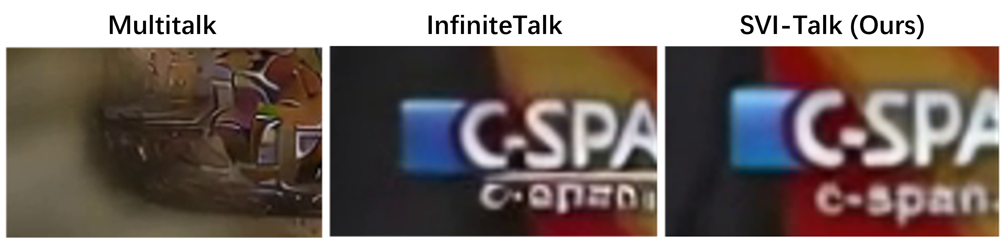

# Frequently Asked Questions (FAQ)

## Q1: Do you have plans to extend SVI to Wan 2.2 and 720p resolution?

Yes! This is our top priority on the TODO list. We are actively working on upgrading SVI to support Wan 2.2 and higher resolutions including 720p.

***PS: We’re collecting TODO suggestions! We want to better meet real user needs—if you have ideas, please share them in our Issues. Also, if you have great reference images and text prompts but lack the resources to run inference, leave them in an Issue and we’ll run the inference for you!***

## Q2: Have you compared SVI-Talk with InfiniteTalk?

To be honest, SVI-Talk was developed under a tight schedule. We only fine-tuned it with 5k toy clips and didn't have time for further optimization.

In our internal comparisons with InfiniteTalk on very small-scale samples:

- **Lip-sync metrics**: Our metrics are very close to InfiniteTalk, though slightly lower (likely because we didn't have time to tune the audio cfg properly)
- **SVI advantages**: Significantly better text detail consistency; Superior visual quality (benefiting from our image restoration characteristics). However, these advantages don't show up in typical talking face metrics. (See below figure)
- **Long-form generation**: We tested 10-minute talking videos with absolutely no drifting issues

  

## Q3: SVI-Film sometimes generates sub-optimal videos. Why?

### Potential Issue 1: Slight color shift. This issue has two main causes:

1. **VAE encoding-decoding errors**: The VAE itself accumulates errors through repeated encoding-decoding, especially in static environments. If you repeatedly encode and decode the same image, you'll notice progressive quality degradation. Since our method operates in latent space, these errors can partially escape SVI's constraints.
2. **Limited training data scope**: Our SVI uses LoRA trained on small-scale datasets, so its style and error patterns are constrained by the training data types. When test images or text prompts differ significantly from the training distribution, sub-optimal generation can occur.

**Best solution**: Fine-tune with a small amount of video clips that match your target style/domain. This is the most effective way to adapt SVI to your specific use case. Moreover, LoRA not only learns error-elimination capabilities but also indirectly learns the generation style of the videos. Therefore, you can better control the long-range style consistency through LoRA fine-tuning (e.g., Tom & Jerry), which only requires several hours of tuning.

### Potential Issue 2: Limited Motion and Scene Transitions

1. **Check your resolution**: Our model is trained on a 480p base using 480×832 resolution. During testing, image processing follows the width-limited principle. If your image resolution is too large (e.g., 2150×1204), it will be resized to 1472×832. This gap from the training resolution can lead to missing motion. Therefore, please adjust `--max_width` to an appropriate value. You can check the terminal log to verify: "Video dimensions: 832x1472". Additionally, excessively large sizes will slow down inference. For more details, please refer to Issue #6.

2. **Text CFG**: This is very important for text following (Wan I2V has this issue as well). If you notice ghosting artifacts or poor text following, increase the CFG value. For example: `--cfg_scale_text=7`. We typically find that if the test data style differs significantly from the training data, it's necessary to increase the CFG.

3. **Text Prompt**: Providing an appropriate prompt is crucial for motion generation, especially for scene transitions. For more details, please refer to Issue #6. Additionally, regarding prompt language style, the training dataset's prompts tend to follow a more AI-like (GPT-style) format (人机 in Chinese), which actually simplifies prompt creation—simply providing a longer LLM-generated string can yield good results. This may be a productivity advantage worth leveraging HAHAHA.

## Q4: Did you consider building upon the Self-Forcing series of works?

Initially, we did want to build upon Self-Forcing, but several critical issues led us to abandon this approach:

1. **T2V-only limitation**: Self-Forcing only supports text-to-video (T2V), whereas most application scenarios—such as talking faces—require image-to-video (I2V) capabilities. While I2V can easily accommodate T2V (simply by providing a T2I-generated first frame), the reverse is much more difficult.

2. **Model scale constraints**: Self-Forcing is based on a 1.3B parameter model, and we found that the visual quality could hardly reach the cinematic level we aimed for (e.g., our Iron Man demo).

3. **Different objectives**: The Self-Forcing series is better suited for scenarios prioritizing real-time interaction (e.g., gaming), where visual quality does not need to reach cinematic standards. In contrast, our work focuses on story content creation, requiring higher standards for both content and visual quality. Therefore, the current version can generate a 2-minute 480p story using H100 GPUs overnight, which aligns well with our objectives.

4. **Causality considerations**: Self-Forcing achieves frame-by-frame causality, whereas SVI operates at a clip-by-clip or chunk-by-clip level of causality. This level of autoregression aligns with the characteristics of large language models.

## Q5: What do the parameters in test bash scripts mean?

- **`--num_motion_frames`**: Controls the number of cross-clip reference frames. In SVI-Film, this is used to ensure coherence across scene transitions. Please use our default value because it is aligned with the training.
- **`--num_clips`**: Specifies how many video clips to generate. Each clip represents 81 frames.
- **`--max_width`**: Controls the maximum width of test images during processing (maintaining the aspect ratio). Please adjust according to Q3 if needed.
- **`--cfg_scale_text`**: Controls the text CFG. Please adjust according to Q3 if needed.
- **`--ref_pad_num`**: Controls the padding method for reference images:

  - **`-1`**: Pads with a random frame. Used for single-scene video generation (e.g., SVI-Shot/Dance/Talk). This simplifies the task into a restoration problem based on unpaired data with the reference image, thereby eliminating any drift or forgetting issues.
  - **`0`**: Pads with zeros. Relaxes the single-scene constraint. In this mode, when the subject moves out of the clip, there is a probability of forgetting.
